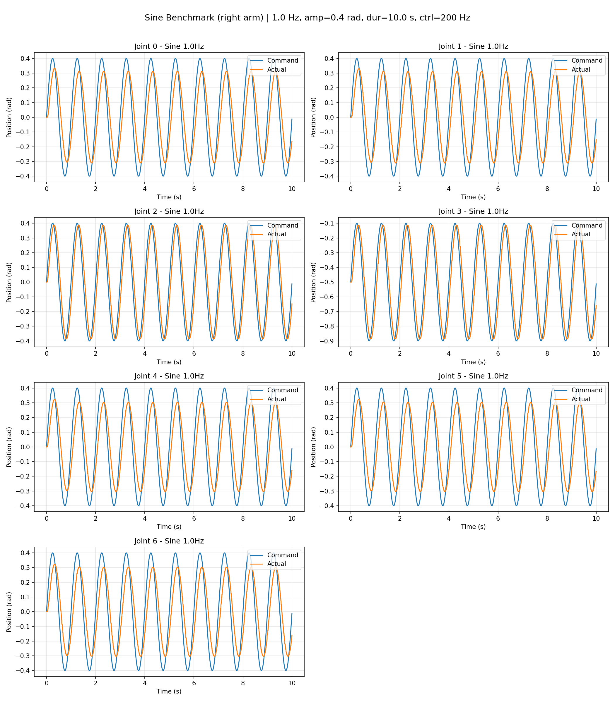
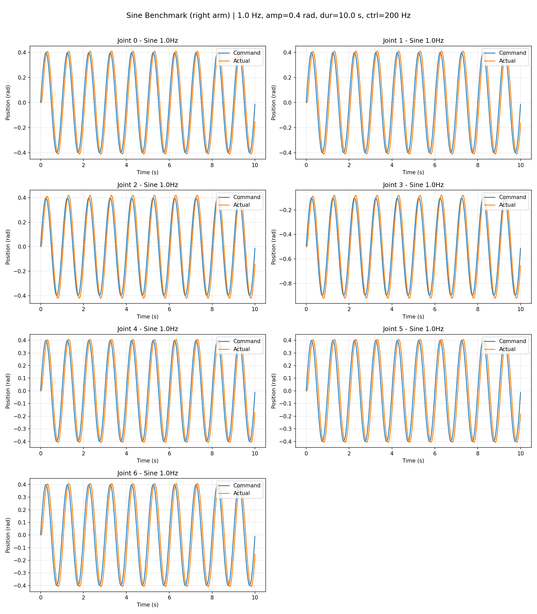

# Arm Tracking Benchmark

Benchmark scripts for measuring per-joint tracking performance of either arm. Use these to compare tracking behavior before and after tuning PID or other control parameters.

> **Note:** If you run these benchmarks from a remote machine (not the robot's onboard computer), the measured tracking latency will include network round-trip time. This is especially significant when either device is on WiFi. For the most accurate control-loop measurements, run directly on the robot computer or use a wired Ethernet connection.

## Scripts

| Script              | Test Type          | Control Method                                        |
| ------------------- | ------------------ | ----------------------------------------------------- |
| `sin_benchmark.py`  | Sine wave tracking | `set_joint_pos_vel` (position + velocity feedforward) |
| `step_benchmark.py` | Step response      | `set_joint_pos` (position only)                       |

## Usage

```bash
# Test the left arm
python examples/benchmark/arm_tracking/sin_benchmark.py --side left
python examples/benchmark/arm_tracking/step_benchmark.py --side left
```

## PID Comparison

You can use these benchmarks to compare arm tracking performance under different PID settings. The `reference/` folder contains example results for visual comparison.

> **Note:** The reference PID values below are only an example. The most appropriate PID parameters are highly dependent on your application and usage. A single set of PID parameters is unlikely to be optimal for all tasks — you should tune based on your specific requirements (e.g. tracking accuracy vs compliance vs safety).

### PID Multiplier Constraints

- P-gain multipliers are capped to the range **[0.1, 4]**. Values outside this range are not permitted for safety reasons.
- A **higher P multiplier means higher stiffness**: the arm resists deviations from the commanded position more aggressively. While this improves tracking accuracy, a stiffer arm generates larger forces on collision, which can be more dangerous. Choose the lowest multiplier that meets your tracking requirements.

### Workflow

1. **Run with default PID** — run the benchmark to get a baseline:
2. **Set custom PID** — use the PID configuration example to change P-gain multipliers:
   ```bash
   # Example: set higher P-gains for tighter tracking (values must be in [0.1, 4])
   python examples/advanced_examples/config_arm_pid.py set \
       --side right --p-multipliers 3.5 3.5 2.0 2.0 3.5 3.5 3.5
   ```
   See `examples/advanced_examples/config_arm_pid.py` for full usage.
3. **Run again** — run the same benchmark with the new PID:
4. **Compare** — open the two `summary.png` files side by side.

### Reference Images

| Image                            | PID Setting                       | Description                          |
| -------------------------------- | --------------------------------- | ------------------------------------ |
| `reference/default_pid_sine.png` | Default (1.0x all joints)         | Baseline tracking with factory PID   |
| `reference/custom_pid_sine.png`  | [3.5, 3.5, 2, 2, 3.5, 3.5, 3.5] | Tighter tracking with higher P-gains |

**Default PID**



**Custom PID** `[3.5, 3.5, 2, 2, 3.5, 3.5, 3.5]`



## Parameters

### sin_benchmark.py

| Parameter         | Default | Description                       |
| ----------------- | ------- | --------------------------------- |
| `--side`          | right   | Which arm to test (left or right) |
| `--duration`      | 10.0    | Test duration per joint (seconds) |
| `--control-hz`    | 200     | Control loop frequency (Hz)       |
| `--amplitude`     | 0.4     | Sine wave amplitude (rad)         |
| `--sin-frequency` | 1.0     | Sine wave frequency (Hz)          |
| `--output-dir`    | results | Base output directory             |

### step_benchmark.py

| Parameter           | Default        | Description                                      |
| ------------------- | -------------- | ------------------------------------------------ |
| `--side`            | right          | Which arm to test (left or right)                |
| `--duration`        | 5.0            | Test duration per joint (seconds)                |
| `--control-hz`      | 200            | Control loop frequency (Hz)                      |
| `--step-amplitude`  | 0.524 (30 deg) | Step amplitude (rad)                             |
| `--step-time`       | 0.3            | Step start time (seconds)                        |
| `--transition-time` | 0.3            | Step ramp duration (seconds)                     |
| `--max-vel`         | auto           | Max velocity (rad/s), auto-calculated if omitted |
| `--output-dir`      | results        | Base output directory                            |
| `--no-confirm`      | false          | Skip safety confirmation                         |
